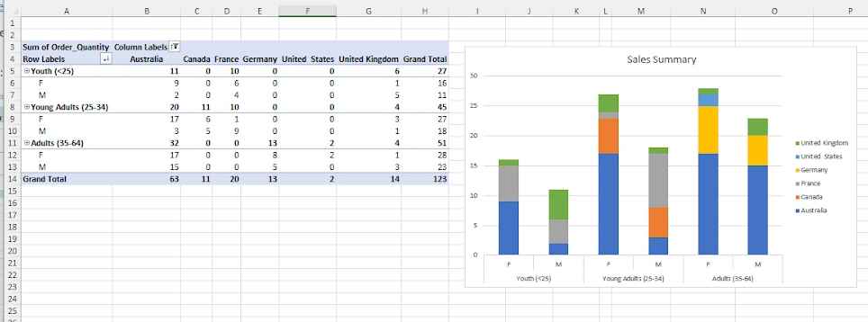

# Week 1 Excel
In Week 1, I demonstrated key features such as sorting, filtering, and changing data types. I implemented functions such as **SUM**, **AVERAGE**, and **MAX**. Additionally, I utilised more advanced features of Microsoft Excel, namely pivot tables, data visualisation, and conditional formatting.
S

